<div align="center">
  
  
  <br />

  # 🕊️ FLY FRAMEWORK
  ### **Stop configuring. Start building.**
  
  **"The Internal-First Runtime Platform for the Post-2026 PHP Era."**

  <p align="center">
    <a href="https://php.net"></a>
    <a href="LICENSE"></a>
    <a href="PROGRESS.md"></a>
    <a href="https://github.com/imcanugur/fly-framework"></a>
  </p>
</div>

---

## 🎯 The Core Philosophy

> **"Simple things should feel simple. Complex things should remain possible."**
> — *The Fly Engineering Manifesto*

Fly Framework is a **philosophical rebellion** against the "black-box" culture of modern development. While other frameworks are a collection of external dependencies stitched together, Fly is a **monolithic masterpiece** where every line of code was written to serve a singular, cohesive vision.

---

## ⚡ Technical Supremacy: Internal-First Engineering

Fly rejects the "package-hunting" culture. We don't use Symfony, Laravel components, or Doctrine. **We build the tech.**

### Why Internal-First?
- **Zero Vendor Pollution**: Your `vendor/` directory stays lean. No 200MB dependency hell.
- **Architectural Harmony**: Every component (Router, ORM, Container) speaks the same language.
- **Predictable Performance**: No hidden middleware or complex event chains from external libs.
- **Mastery**: You don't just use Fly; you understand exactly how it processes every byte.

---

## 🛠️ The Engine: God-Tier Modules

<table width="100%">
  <tr>
    <td width="33%" valign="top">
      <h3>🚀 The Router</h3>
      <p>A regex-powered, high-concurrency engine that compiles routes into static PHP patterns.</p>
      <ul>
        <li><b>$O(1)$ to $O(n)$</b> Matching</li>
        <li>Onion Architecture Pipelines</li>
        <li>Intelligent Type Constraints</li>
      </ul>
    </td>
    <td width="33%" valign="top">
      <h3>💎 The ORM</h3>
      <p>A lightweight Active Record implementation designed for speed and developer ergonomics.</p>
      <ul>
        <li><b>Dirty Tracking</b></li>
        <li>Relationship Hydration</li>
        <li>Native Soft Deletes</li>
      </ul>
    </td>
    <td width="33%" valign="top">
      <h3>📦 The Container</h3>
      <p>Pure reflection-based DI container with zero configuration.</p>
      <ul>
        <li><b>Auto-Wiring</b></li>
        <li>Singleton Awareness</li>
        <li>Service Provider Ecosystem</li>
      </ul>
    </td>
  </tr>
</table>

---

## 🔥 Performance Benchmarks (Fly vs. The World)

Fly is designed for zero-latency execution.

| Metric | Fly Framework | Typical Framework | Advantage |
| :--- | :--- | :--- | :---: |
| **Cold Boot Time** | **< 0.8ms** | 15ms - 60ms | **🚀 20x - 75x** |
| **Memory per Req** | **~450 KB** | 5MB - 15MB | **🧠 10x - 30x** |
| **Throughput** | **6k+ req/sec** | 800 - 1.2k req/sec | **🔥 God-Tier** |

---

## 🧬 Traceable Architecture

```mermaid
graph LR
    subgraph "The Entry Point"
        A[index.php] --> B[Application Container]
    end
    subgraph "The Engine"
        B --> C[Bootstrap Loader]
        C --> D[Service Providers]
        D --> E[Middleware Pipeline]
    end
    subgraph "The Execution"
        E --> F[Router Match]
        F --> G[Controller Resolve]
        G --> H[Action Execute]
    end
    subgraph "The Response"
        H --> I[Response Stream]
        I --> J[Terminable Lifecycle]
    end
    style B fill:#ffb800,stroke:#333,stroke-width:4px,color:#000
    style F fill:#007bff,stroke:#fff,stroke-width:2px,color:#fff
    style I fill:#28a745,stroke:#fff,stroke-width:2px,color:#fff
```



---

## 🚀 Show Me The Power

<details>
<summary><b>1. Schema & Database Mastery</b></summary>

```php
Schema::create('users', function (Blueprint $table) {
    $table->id();
    $table->string('email')->unique();
    $table->string('password');
    $table->timestamps();
});
```
</details>

<details>
<summary><b>2. Fluent Controller Logic</b></summary>

```php
// app/Http/Controllers/UserController.php
public function store(Request $request)
{
    $user = User::create($request->only('email', 'password'));
    event(new UserRegistered($user));
    return Response::json($user, 201);
}
```
</details>

<details>
<summary><b>3. The Native Template Compiler</b></summary>

```blade
<x-layout>
    @telemetry('user-list')
        <f:list :items="$users" />
    @endtelemetry
</x-layout>
```
</details>

---

## 📂 Project Anatomy

```text
├── app/             # Application Logic (Controllers, Models, Middleware)
├── bootstrap/       # System Bootstrapping
├── config/          # Environment Driven Configuration
├── core/            # The Fly Engine (The "Forbidden" Tech)
├── public/          # HTTP Entry Point & Assets
├── resources/       # Views, Language, and Raw Assets
├── routes/          # Web & API Route Definitions
└── fly              # The Framework Binary
```

---

## 🛤️ The Flight Path (Roadmap)

- [x] **Core Engine**: Container, Router, HTTP, Middleware.
- [x] **Data Layer**: Schema Builder, Query Builder, ORM.
- [x] **Visual Layer**: Native Compiler, Components, Telemetry.
- [ ] **Event System**: Dispatcher, Listeners, Model Observers.
- [ ] **Queue Runtime**: Asynchronous Task Processing.
- [ ] **Cache Layer**: Redis, File, and Memory Drivers.
- [ ] **Auth System**: Guards, Providers, and Policy Engine.
- [ ] **Realtime**: Native WebSocket Server.

---

## 🤝 Become a Runtime Engineer

Fly is not just code; it's a **legacy**. We are building the future of PHP, and we want you to be part of it.

1. **Star** the repository and join the elite 1%.
2. **Fork** and contribute to the core engine.
3. **Build** something that was previously impossible.

---

## 📄 License

The Fly Framework is open-sourced software licensed under the [MIT license](LICENSE).

---

## 👨‍💻 The Architect

<div align="center">
  <table width="100%" style="border: none; background: transparent;">
    <tr>
      <td align="center" style="border: none;">
        <a href="https://github.com/imcanugur">
          
        </a>
        <br />
        <br />
        <h2>Can Uğur</h2>
        <p><b>Creator & Primary Architect</b></p>
        <p><i>Building the absolute zenith of PHP performance.</i></p>
        <a href="https://github.com/imcanugur"></a>
      </td>
    </tr>
  </table>

  <br />
  <h3>Stop configuring. Start building.</h3>
  
  <br />
  <sub>Built with vision by <a href="https://github.com/imcanugur">Can Uğur</a></sub>
</div>
